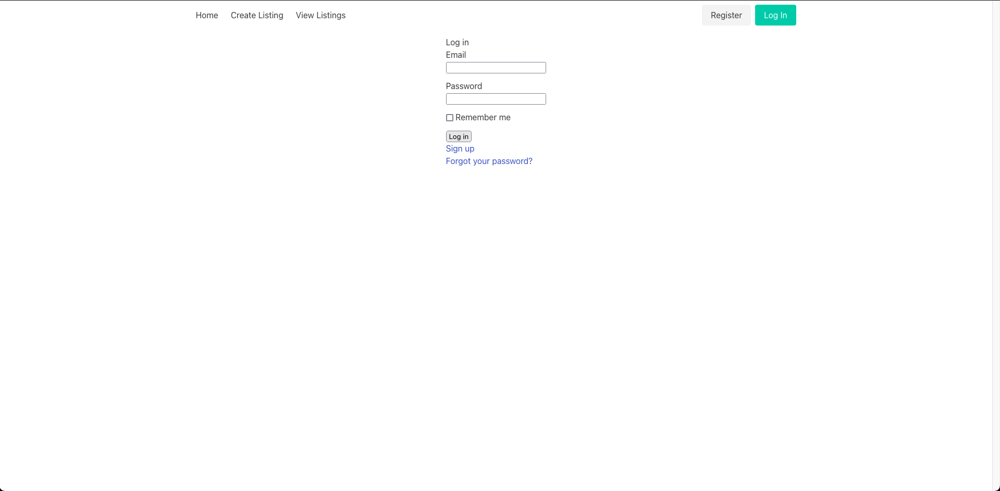

This app is a marketplace for privately run fitness classes. It is called Fitby.

Note: This app is somewhat lacking in its current state. I will be completing another CRUD focused rails app shortly to better demonstrate my skills.

# A link to the deployed app

[Heroku Deployment](https://fitby-marketplace.herokuapp.com/)

# Description of the app

Fitby is a two sided marketplace that connects trainers who run fitness classes, with users, who want to join those classes

## Features

* Home page
* Create listings page
  * Contains many related fields
  * Upload one associated image
* View listings page
  * Shows all fitness class listings
  * Contains links to user profile pages
  * Contains links to listing pages
* Account page
  * Allows for account management via two settings
  * One setting allows email/password changes
  * The other is for updating profiles
  * Upload one associated image
* Manage users page
  * Admin user only page for deleting or editing user accounts
* Authentication through Devise
* Authorisation through Pundit and Rolify

## Tech stack
* Languages
  * HTML
  * CSS - Bulma
  * ERB
  * Rails under the hood languages - SQL, JS perhaps
* Deployment platform: Heroku
* Image hosting: Cloudinary

## Sitemap

## Screenshots

